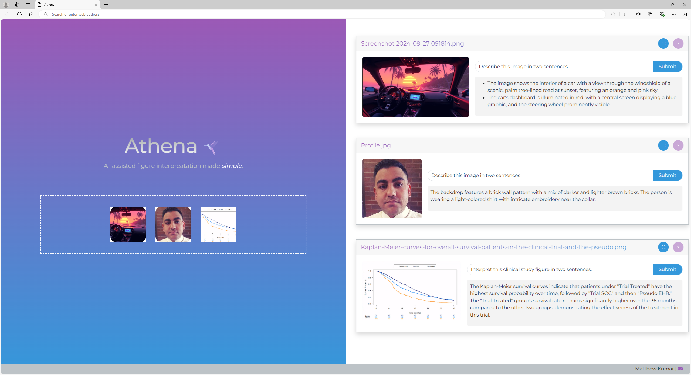

<h2>The App</h2>

Athena is a simple web app with a single purpose: allow users to easily obtain AI-assisted descriptions of their images. A lot of thought went into the user interface and experience, though not necessarily effort 😜. More on that later.  
 
 

At it's core, Athena allows:

👉 Easy upload of your images - drag and drop into the file drop area  

👉 You can also paste  files or drag  most images from the web too (e.g. google images)  

🌿 Each time a file is uploaded, a card is created. Each card contains the image thumbnail, editable prompt, trigger button and a response area.  

It's really that simple. Give it a try!

> ⚠️ The app deployed on ghp is inert; you'll need to clone the repo and adjust *utils.js* to point to your LLM api end point along with your api key 🔐

 
<h2>Why make this?</h2>

Well, UI has always been a passion of mine, but UX too. In our internal platforms for LLMs, it can be a bit cumbersome to perform image interpretation. I wanted a streamlined way to do a task I perform frequently at the drop of a hat 🏃🏻‍♂💨️   
 
 
  
I also chose to do this as a static webpage because I thought a shiny app would be overkill for this 😅.

<h2>Assurance</h2>

I didn't do the majority of the programming for Athena. GPT-4O and GPT-4O-mini <i>did</i>. As a secondary objective, I was curious whether:  
 
 
❓ This app  could be generated completely by AI itself?    
 
❓ Will I have a job in a few years 😂   ?
 
 

I'm happy to share that generative AI, at the least the models I employed, were not enough to generate this completely. Even with several attempts and strategies of prompting 📝, it still required quite a bit of human-in-the-loop to get it right 👫. Here's a few points on my experience:
 
 
✔️ AI was helpful in getting started from scratch. Everything from scaffolding files in a structured way that made working on the app easier
 
 
✔️ Basic CSS, HTML tasks were do-able with ease
 
 
⚠️ Advanced CSS and JS required frequent iteration and testing 🔄. This was frustrating and time ⌛ consuming.
 
 
✔️ Common tasks like using fetch API to access openai's end point are well understood
 
 
⚠️ Specifying named JS libraries were amenable, but only after I specifically prompted it's use. It was really hard to get the file-area-upload from first principles. However, I knew about [dropzone.js](https://www.dropzone.dev/), so I asked it to use it instead. It didn't work 100% out of the box, so I still had to read the documentation and alter the generated code.
 
 

In the end, I probably could have coded this myself more quickly than ask AI to generate it. I realize there's a lot of things that you need to be deeply aware of before you can ask AI to generate you something as complex as a web app. For example, JS libraries, CSS frameworks (Bootstrap 5 class names), Names (HTML elements, CSS selectors, function names), and even coding approaches for efficiency. 
 
 
It's not push start. At least not with these models. I wonder how Strawberry would do 🤔

In sum, my job is at least safe for the next bit 🙆

Till next time!

🍻🌴
