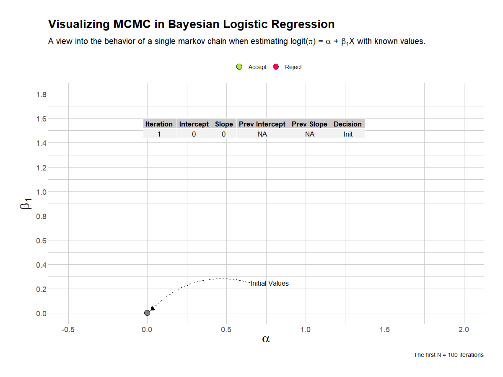
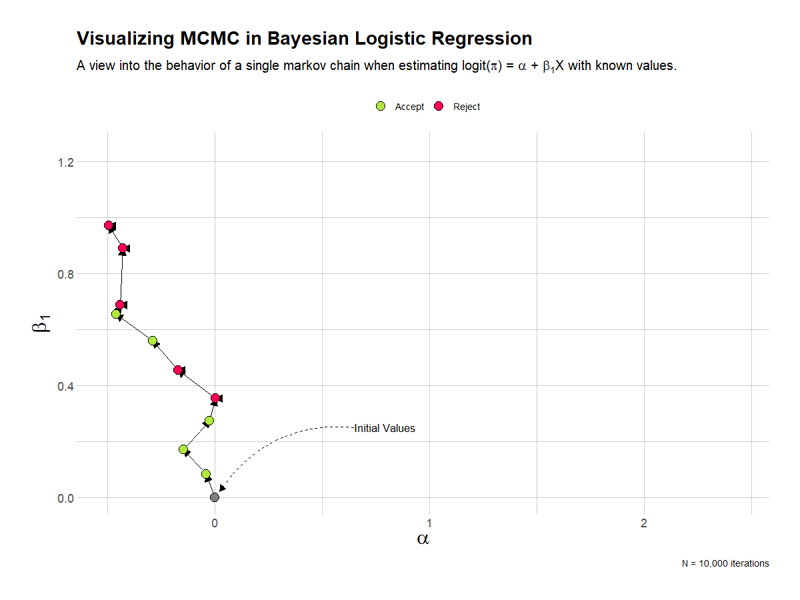
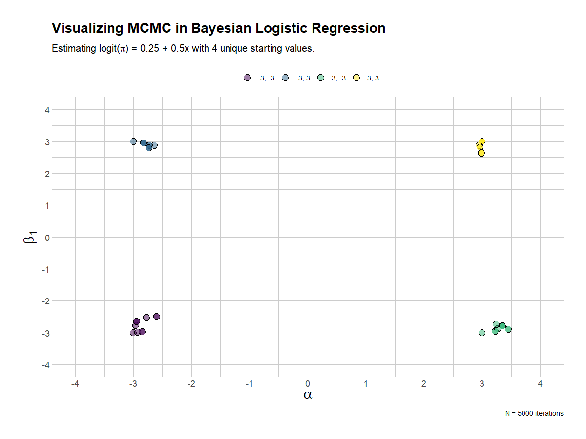

My educational background and training was in Biostatistics. Throughout my career, I've served many different roles, from statistician to programmer to epidemiologist to most recently, computational scientist. Over the last bit, I've kind of lost touch with my mathematical and statistical roots. Every so often, I will dive back into some concepts to remind myself how it works and learn of any new developments.

Bayesian statistics was an interesting course in my graduate program. Unfortunately, I haven't used it as much as I would have wished, but I am simply fascinated by the math. At the same time, it can be challenging to wrap your head around what's going on underneath the hood in the estimation process. This is precisely why I made this post.

>I'll stop here to direct you towards the original (more comprehensive) post I made concerning this topic, which can be found [here](https://rpubs.com/matt-kumar/mcmc)

In short, this project involved a few key activities that helped refresh my memory and deepen my understanding, all through using R, animation and simulation.

+ Simulating data arising from a statistical model with known parameters. Logistic regression was the use case.

+ Fitting the model on simulated data to recover the known parameters, verifying the simulation worked. 

+ Building an MCMC sampler (Random Walks Metropolis-Hastings) in order to fit a Bayesian version of the logistic regression model

+ Understand exactly what the algorithm does at each step and visualize this via animation. Understand the impact of different priors, candidate distributions, and jump steps in the algorithm.

+ Compare results obtained through the MCMC sampler against what we previously obtained.

To this end, I prepared three visualizations I'd like to share.

 

This visualization shows the first 100 iterations of a single chain in estimating the parameters of the Bayesian logistic regression analysis. I've overlaid a table that shows the current and previous values, and the decision taken by the algorithim.

This visualization shows the full 10,000 iterations of the single chain. I've removed the table of estimates. Here it's quite clear that the chain quickly settles into the area of the known parameter estimates.

The last visualization mixes things up a bit, by providing 4 chains, each with different starting or initialization values. In the end, they all converge. Kind of.

Hope you find it useful!
