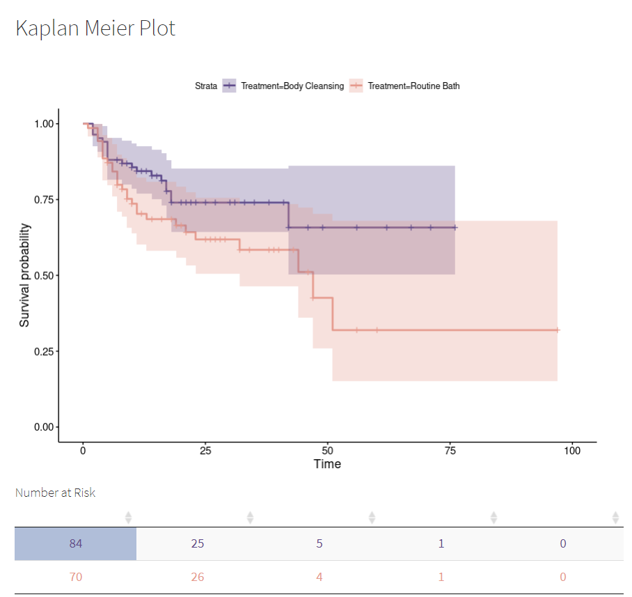
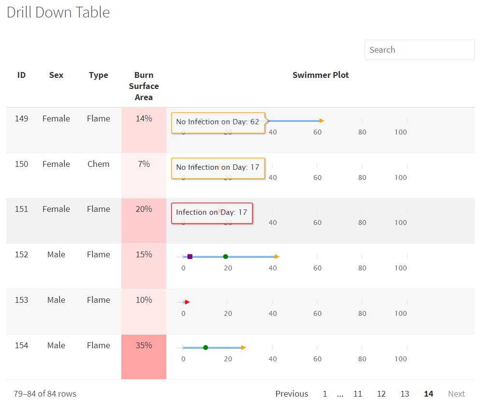

The following project was an entry into the first R Studio table contest held in 2020.

It depicts a standard survival analysis using the Kaplan-Meier method. Accompanying the graph is an interactive Number at Risk (DT) table which can be clicked.

Upon clicking a cell of the Number at Risk table, a second (Reactable) table is produced for those subjects. 

In this table, contextual information is given for these subjects and an inline, interactive swimmer plot (Highcharter) is also produced.

Sadly this table did not place in the contest, though parts of it have made it's way into some of our team projects.

I learned a lot about JS and Reactable in this project, which has since become my display table package of choice within R :)
 