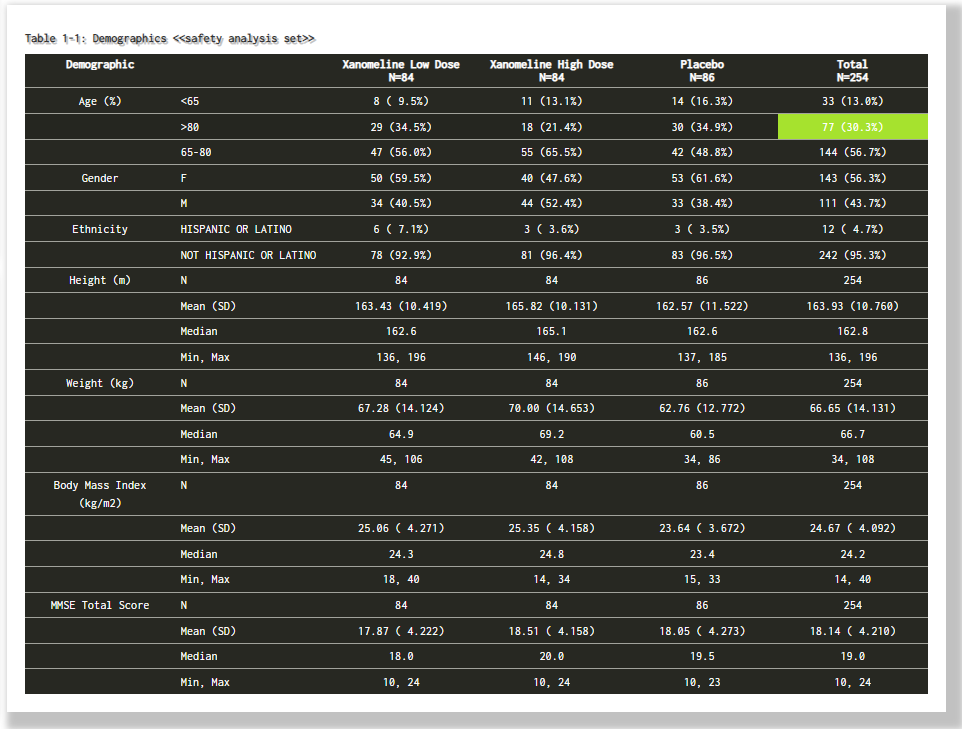
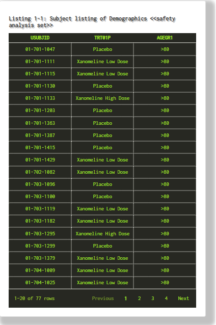
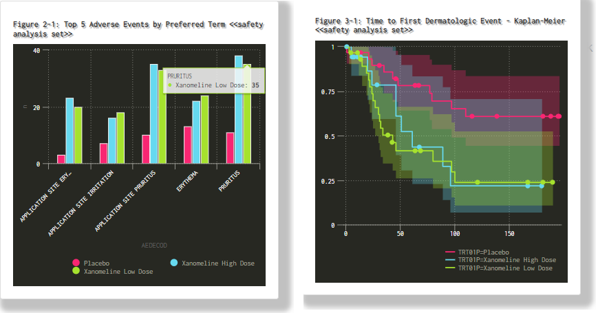
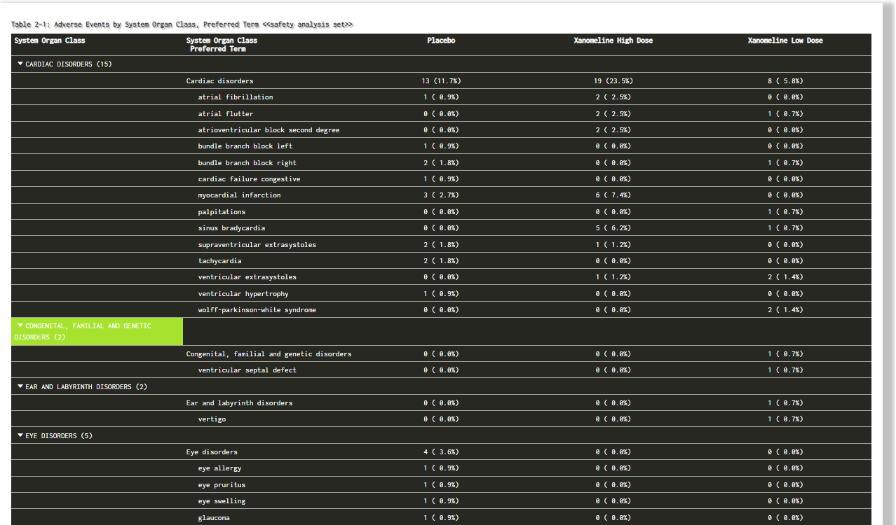

<h2>Overview</h2>
On March 31, 2022 I had the pleasure of attending the CDISC Open Source Alliance (COSA) Spotlight where  from various CDISC community members shared exciting developments from their work. If you're interested in the recording, it can be viewed <a href="https://www.cdisc.org/events/webinar/cdisc-open-source-alliance-spotlight">here.</a> 
 
 
Among presenters were <a href="https://www.linkedin.com/in/michael-s-stackhouse/">Mike Stackhouse</a> and <a href="https://www.linkedin.com/in/eli-miller-90532a87/">Eli Miller</a> from <a href="https://www.atorusresearch.com/">Atorus</a> demonstrating a new feature coming to <code>{Tplyr}</code>: <b>the ability to to query and retrieve individual observations from a summary table using a metadata-driven approach.</b>
 
 
Imagine a generic table. Imagine clicking on a particular cell of that table. Imagine being able to easily identify patients that comprise that cell. Let that sink in for a second as I did. Pretty powerful stuff...

<h2>An Example</h2>
Excited to give it a try, I spent the weekend coding up this example. It uses a demographics table as an anchor. Once a cell is selected, a variety of TLFs are <b>linked</b> for the patients in that cell.
 
 
Here is the anchor TLF. I've clicked on the overall total cell for patients categorized as being > 80 years of age. There are N = 77 such patients.  

Here is the first linked TLF. A simple listing of the N = 77 patients. In Tplyr, you can specify any additional columns you wish to have too.

I mentioned figures! Here is a safety figure and an efficacy figure for those N = 77 patients. Each of these figures are also interactive thanks to `{highcharter}`.

Lastly, here is a TLF from a completely separate section (i.e. safety) for those N = 77 patients. I've leveraged some of the neat features of `{reactable}` to nest things.

<h2>Forward</h2>
Now take this impulse and multiply it by an entire catalog of TLFs and add to it Shiny's capabilities - what have you got? 
 
 
A Swiss army knife of productivity capable of serving many functions. Think stat analysts, statisticians, medical writing and more...

<h2>Access</h2>
You can try the app I created for this example <a href="https://matt-kumar.shinyapps.io/linked_tlfs/">here.</a>
 
 
You can also access the specific build of `{Tplyr}` with these capabilities by going <a href="https://github.com/atorus-research/Tplyr/tree/gh_issue_32">here.</a> 

>`remotes::install_github("atorus-research/Tplyr@20beb73cd4c202308afbbb57c1f2b6e1590295b7")`

I'll definitely be keeping an eye on more developments and hope to share more with you here.