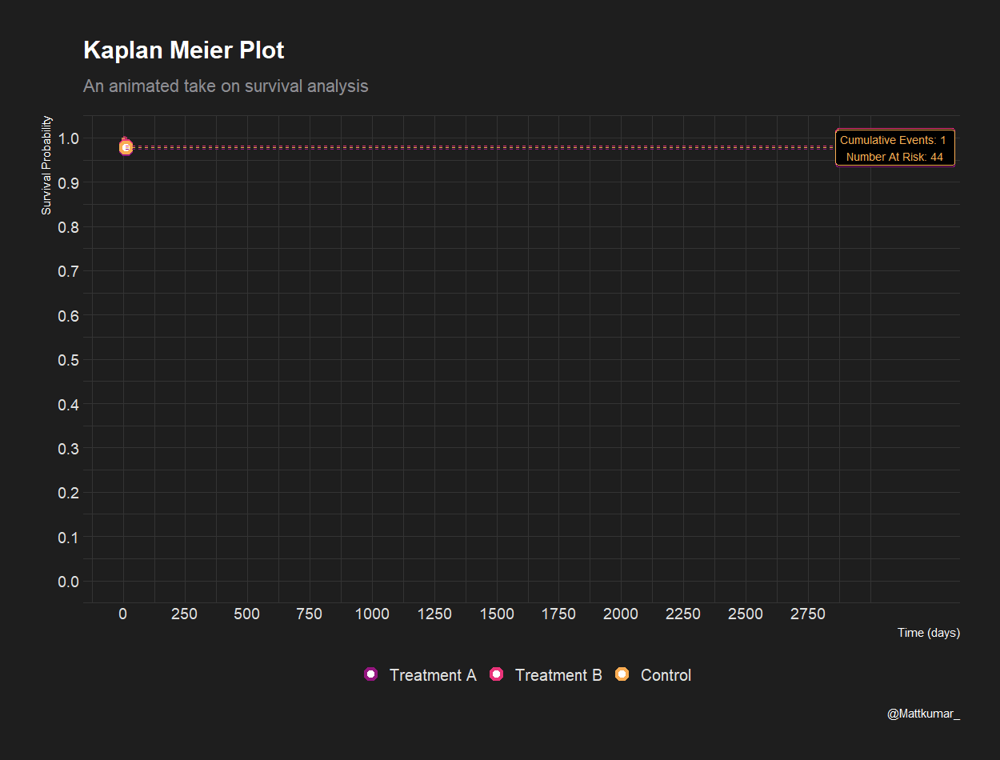
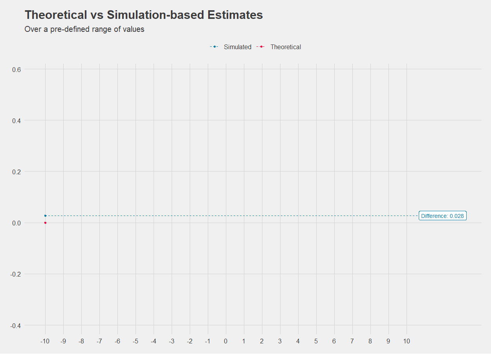

This was a neat experiment using the `{gganimate}` package for storytelling purposes. In the Kaplan-Meier plot, animation serves as the vehicle to unravel chronological events in a fictitious Oncology clinical trial. 

Some features include:
+ Animation of the individual survival curves over time - here you can see how fast the probability of survival drops quite clearly.

+ Tracking of number of events and number at risk in real time.

+ The use of stopping points to emphasize when the median survival time is achieved

+ The use of stopping points to emphasize contextual information such as planned analyses dates and results of interim stats. Note: may or may not make actual sense given the data.

 

I also had a bit of fun to see where else this could potentially play a role. In the below graph, we compare theoretical versus observed values from a simulation study to see where across the axes the biggest differences lie.

This was experiment sparked further discussion into how we can help our Stat colleagues during their round-table discussions. It was eventually spun off into a shiny app.

Good times.
